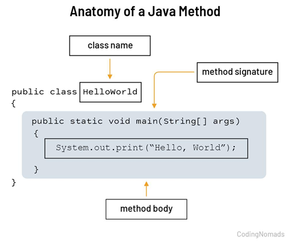
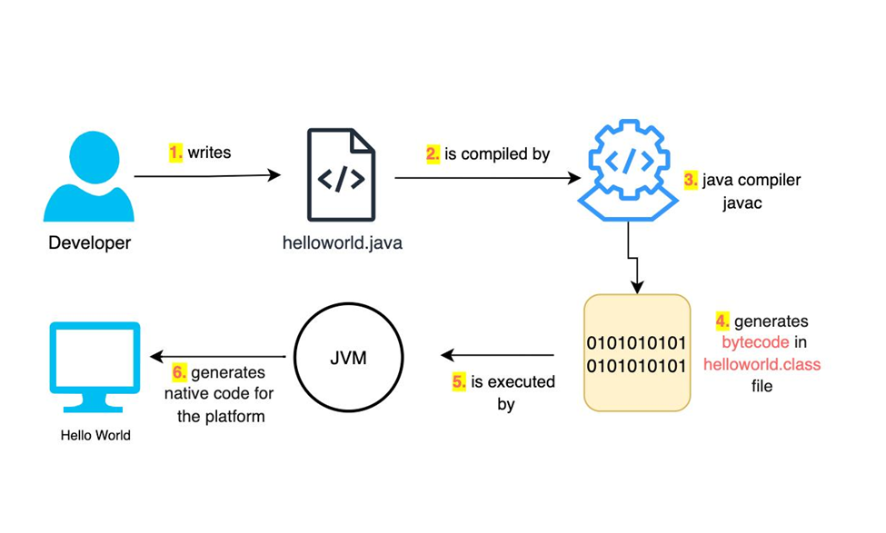
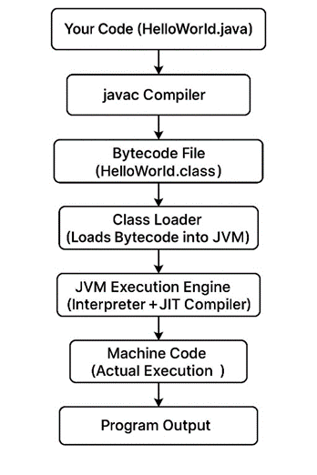

# Hello World Program Internal Working

## Hello.java [filename]

```java
class Hello {
    public static void main(String args[]) {
        System.out.println("HelloWorld");
    }
}
```

---

## 🔹 Anatomy of Java Method

<p align="center">
  
</p>

---

## 🔹 What Happens Internally (Step-by-Step)

<p align="center">
  
</p>

---

## 1. Compilation

You run:

```bash
javac Hello.java
```

👉 Output:

```text
Hello.class
```

- Your code is converted into bytecode
- Still not executable by hardware

---

## 2. Execution Command

```bash
java Hello
```

`Hello` → this is class name

This starts the Java Virtual Machine

---

## 🔹 Java Execution Flow

<p align="center">
  
</p>

---

## 3. Class Loading

- JVM loads `Hello.class` using ClassLoader
- Finds the main method (entry point)

---

## 4. Bytecode Verification

JVM checks:

- Is code safe?
- Any illegal operations?

---

## 5. Memory Allocation

JVM creates memory areas:

- Stack → main() method execution
- Heap → Objects (like System)
- Method Area → Class metadata

---

## 6. Execution Engine

- JVM interprets or compiles bytecode (JIT)
- Executes:

```java
System.out.println("HelloWorld");
```

---

## 🔹 What System.out.println Actually Does

- System → a built-in class
- out → static output stream (console)
- println → method to print + new line

👉 It sends `"HelloWorld"` to the console via OS.

---

## 🔹 Visual Flow of YOUR Program

```text
  Hello.java
     ↓
  javac Compiler
     ↓
  Hello.class
     ↓
    JVM
     ↓
  Operating System
     ↓
  Hardware
     ↓
  Output
```

---

## 🔹 Final Output

```text
HelloWorld
```