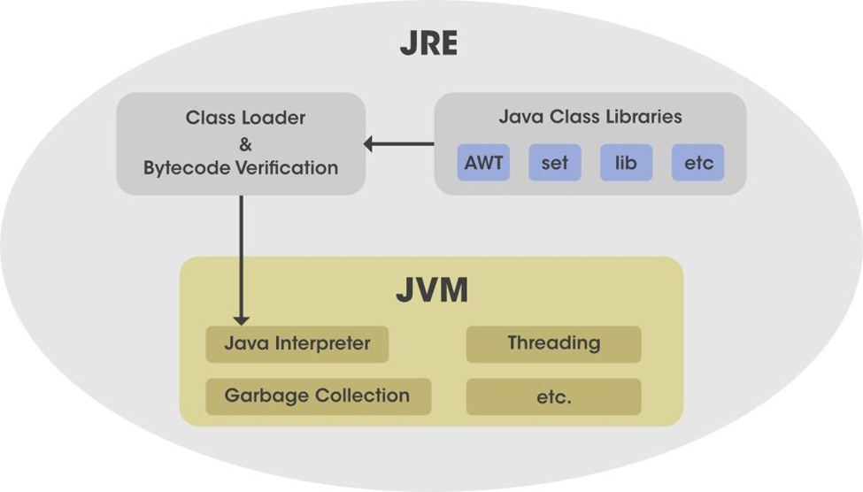
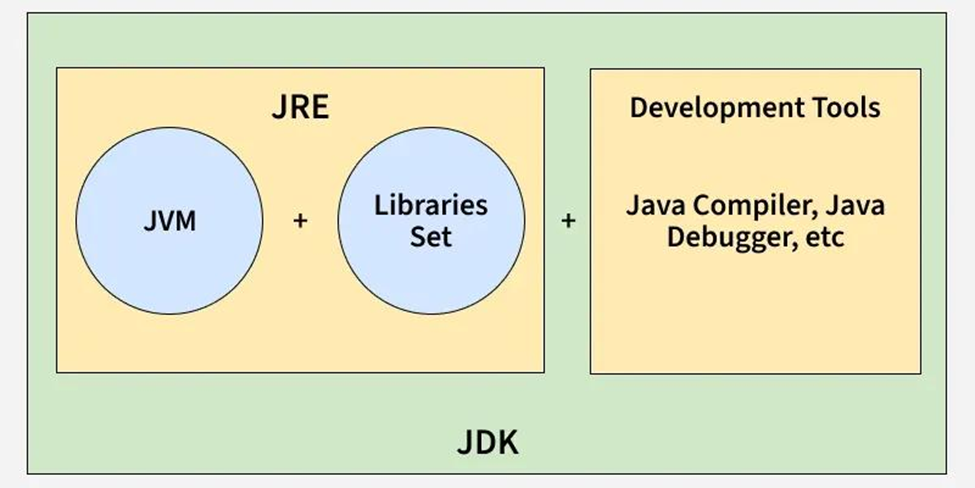
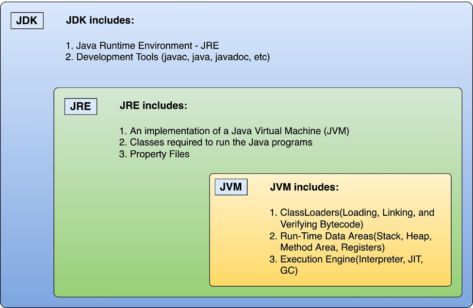

# JDK, JRE and JVM

## 🔹 What is JRE?

JRE (Java Runtime Environment) is the part of Java that is responsible for running Java programs.

👉 In simple terms:

> JRE = Environment needed to execute Java code

It does NOT include development tools (like compiler), only what is needed to run `.class` files.

---

## 🔹 Core Component Inside JRE

The most important part of JRE is:

- Java Virtual Machine (JVM)

👉 JVM actually executes the bytecode.

---

## 🔹 What Does JRE Contain?

### 1. JVM (Execution Engine)

- Loads, verifies, and runs bytecode

Includes:

- ClassLoader
- Execution Engine (Interpreter + JIT)
- Garbage Collector

---

### 2. Core Class Libraries

- Predefined Java classes used by programs

Examples:

- `java.lang` (String, System, etc.)
- `java.util` (ArrayList, Scanner)
- `java.io` (File handling)

👉 Without these, even `System.out.println()` wouldn't work.

---

### 3. Supporting Files

- Configuration files
- Native libraries (`.dll` / `.so` files)
- Security components

---

## 🔹 Diagram of JRE Structure

<p align="center">
    
</p>

---

## 🔹 Simple Structure

```text
JRE
 ├── JVM
 ├── Core Class Libraries
 └── Supporting Files
```

---

## 🔹 JDK vs JRE (Important)

<p align="center">
    
</p>

| Component | Purpose |
|-----------|---------|
| JDK | Development (compile + run) |
| JRE | Only run programs |
| JVM | Executes bytecode |

---

## 🔹 Key Idea to Remember

- JVM → Executes code
- JRE → Provides environment to run
- JDK → Provides tools to develop

---

## 🔹 Complete Java Architecture

<p align="center">
    
</p>

---

## 🔹 One-Line Definition

👉 JRE is a software package that provides the runtime environment, including JVM and core libraries, required to execute Java programs.