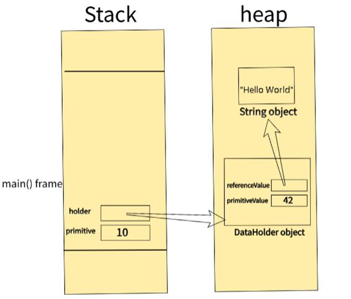
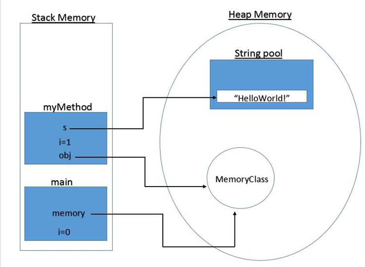

# JVM Memory Management (Stack and Heap)

## 🔹 What is Stack and Heap Memory in Java?

When a Java program runs inside the **Java Virtual Machine (JVM)**, memory is divided into different areas. Two of the most important memory areas are:

- **Stack Memory**
- **Heap Memory**

Understanding these memory areas helps us know where variables and objects are stored while a Java program is running.

---

## 🔹 Stack Memory

**Stack Memory** is used for:

- Method execution
- Local variables
- Function calls

### ✔ Key Features

- Stores method calls (stack frames)
- Each thread has its own stack
- Memory is automatically managed
- Very fast access
- Memory is released automatically when a method finishes execution

<p align="center">
    
</p>

### ✔ Example

```java
void test() {
    int x = 10; // stored in stack
}
```

👉 When the `test()` method finishes, the memory occupied by `x` is automatically removed from the stack.

---

## 🔹 Heap Memory

**Heap Memory** is used for:

- Objects
- Instance variables

### ✔ Key Features

- Stores objects created using the `new` keyword
- Shared among all threads
- Managed by the Garbage Collector (GC)
- Larger memory area than the stack
- Slower access than stack memory

<p align="center">
    
</p>

### ✔ Example

```java
class Student {
    int id;
}

Student s = new Student();
```

👉 Here:

- `s` (reference variable) is stored in the **stack**.
- The `Student` object is stored in the **heap**.

---

## 🔹 Key Differences

| Stack Memory | Heap Memory |
|--------------|-------------|
| Stores local variables | Stores objects |
| Fast access | Slower access |
| Thread-specific | Shared among all threads |
| Automatically freed after method execution | Garbage Collector removes unused objects |
| Fixed size (limited) | Larger and dynamically managed |

---

## 🔹 Simple Analogy

👉 **Stack** = Stack of plates (LIFO – Last In, First Out)

👉 **Heap** = A large storage room where objects are stored and accessed using references.

---

## 🔹 Important Points

- Primitive local variables are usually stored in the stack.
- Objects are stored in the heap.
- Reference variables are stored in the stack and point to objects in the heap.
- When a method completes, its stack memory is automatically released.
- Objects remain in the heap until they are no longer referenced and are removed by the Garbage Collector.

---

## 🔹 Quick Example Together

```java
class Test {
    public static void main(String[] args) {
        int a = 5; // Stack

        Student s = new Student(); // Reference -> Stack
                                   // Object -> Heap
    }
}
```

---

## 🔹 Quick Summary

- Stack → Method execution and local variables
- Heap → Objects and instance variables
- Stack is faster than Heap
- Heap is managed by the Garbage Collector
- Reference variables point to objects stored in the heap

---

## 🔹 One-Line Exam Definition

👉 **Stack memory is used for method execution and local variables, while heap memory is used for storing objects and is managed by the Garbage Collector in Java.**