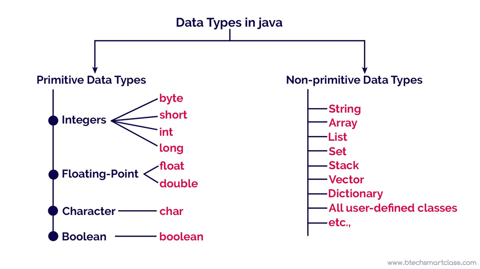
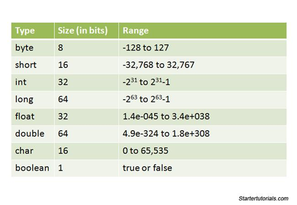
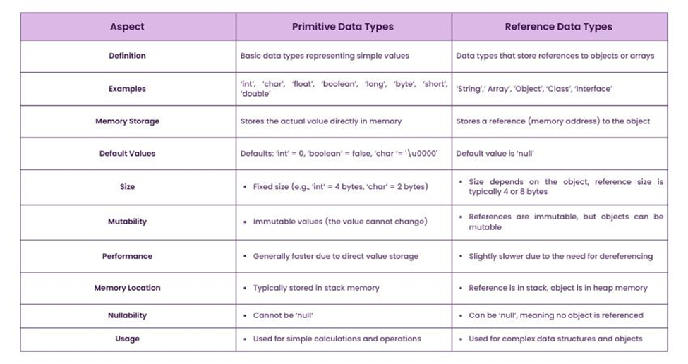

# Data Types in Java

## 🔹 What are Data Types in Java?

A data type in Java defines:

- what kind of data a variable can store
- how much memory it uses
- what operations can be performed on it

👉 In simple terms:

> **Data type = type of value a variable can hold**

### Example

```java
int age = 25;
```

Here, `int` is the data type → it tells Java that `age` stores an integer.

---

## 🔹 Types of Data Types in Java

Java has **2 main categories:**

```text
Data Types
   ├── Primitive
   └── Non-Primitive (Reference)
```

<p align="center">
    
</p>

---

## 🔸 1. Primitive Data Types

These are basic built-in types. They store actual values.

<p align="center">
    
</p>

### ✔ List of Primitive Types

| Type | Size | Example |
|------|------|---------|
| byte | 1 byte | `byte b = 10;` |
| short | 2 bytes | `short s = 100;` |
| int | 4 bytes | `int x = 50;` |
| long | 8 bytes | `long l = 1000L;` |
| float | 4 bytes | `float f = 3.14f;` |
| double | 8 bytes | `double d = 3.14;` |
| char | 2 bytes | `char c = 'A';` |
| boolean | 1 bit (logical) | `boolean flag = true;` |

👉 These are fast and memory-efficient.

---

## 🔸 2. Non-Primitive (Reference) Data Types

These store references (addresses), not actual values.

### ✔ Examples

- String
- Arrays
- Classes
- Interfaces

### Example

```java
String name = "John";
```

👉 Here:

- `name` stores reference
- `"John"` is stored in memory (heap)

---

## 🔹 Key Differences

<p align="center">
    
</p>

| Primitive | Non-Primitive |
|-----------|---------------|
| Stores value | Stores reference |
| Fixed size | Size varies |
| Faster | Slightly slower |
| No methods | Have methods |

---

## 🔹 Quick Summary

Primitive → `int`, `float`, `char`, `boolean` (basic values)

Non-Primitive → `String`, `Array`, `Class` (objects)

---

## 🔹 Important Notes

- String is not primitive, but used very often.
- Default type for numbers is `int`.
- Default decimal type is `double`.

---

## 🔹 Example Programs

Two example programs are provided in this folder to help you understand this topic practically.

### 📄 DataTypesDemo.java

This program demonstrates:

- Declaration of all primitive data types
- Declaration of a non-primitive (`String`) data type
- Printing values of different data types

---

### 📄 PrimitiveVsReferenceDemo.java

This program demonstrates:

- Primitive variables store actual values.
- Non-primitive variables store references.
- Difference between value assignment and reference assignment.

---

## 🔹 How to Execute

Open a terminal in this folder.

### Compile the programs

```bash
javac DataTypesDemo.java
javac PrimitiveVsReferenceDemo.java
```

### Run the programs

```bash
java DataTypesDemo
```

```bash
java PrimitiveVsReferenceDemo
```

Observe the outputs and compare how primitive and non-primitive data types behave.

---

## 🔹 One-Line Exam Definition

👉 **Data types in Java define the type and size of data that a variable can store, and are broadly classified into primitive and non-primitive types.**