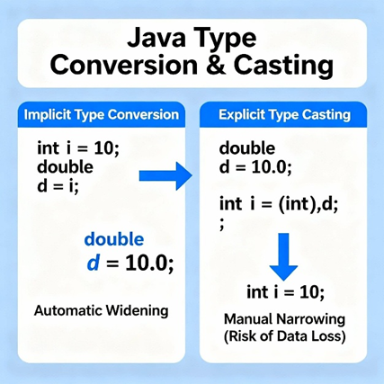
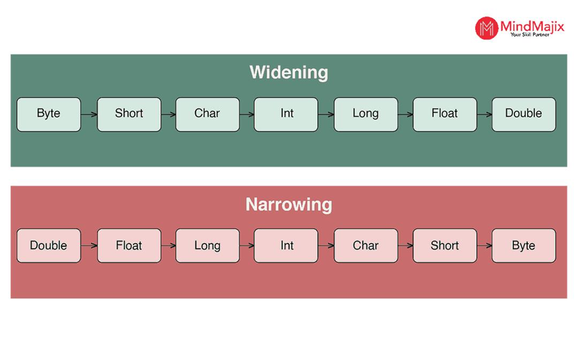

# Type Conversion and Type Casting in Java

## 🔹 What is Type Conversion in Java?

Type conversion means changing one data type into another.

👉 **Example:**

```java
int a = 10;
double b = a;   // int → double
```

Here, `int` is converted into `double`.

---

## 🔹 Types of Type Conversion

There are **2 main types:**

```text
Type Conversion
   ├── Implicit (Automatic)
   └── Explicit (Manual / Casting)
```

<p align="center">
    
</p>

---

## 🔸 1. Implicit Conversion (Widening)

👉 Also called **automatic type conversion**

- Done automatically by Java
- Happens when converting:

```text
smaller type → larger type
```

✔ Safe conversion (no data loss)

### Example

```java
int x = 10;
double y = x;   // automatic conversion

System.out.println(y);  // 10.0
```

---

## 🔹 Flow of Implicit Conversion

<p align="center">
    
</p>

👉 **Order:**

```text
byte → short → int → long → float → double
```

---

## 🔸 2. Explicit Conversion (Type Casting)

👉 Also called **manual conversion**

- Done by programmer
- Needed when converting:

```text
larger type → smaller type
```

⚠ May cause data loss

---

## ✔ Syntax

```java
(type) value;
```

---

## ✔ Example

```java
double d = 10.75;
int i = (int) d;   // explicit casting

System.out.println(i);  // 10 (decimal lost)
```

---

## 🔹 Flow of Explicit Conversion

👉 **Reverse order:**

```text
double → float → long → int → short → byte
```

---

## 🔹 Type Conversion vs Type Casting

| Feature | Type Conversion | Type Casting |
|---------|-----------------|--------------|
| Meaning | Automatic conversion | Manual conversion |
| Done by | Java | Programmer |
| Safety | Safe | Risk of data loss |
| Direction | Smaller → Bigger | Bigger → Smaller |

---

## 🔹 Simple Examples Together

### Implicit (Automatic)

```java
int a = 5;
double b = a;
```

### Explicit (Manual)

```java
double x = 9.8;
int y = (int) x;
```

---

## 🔹 Key Points to Remember

- Implicit = safe & automatic
- Explicit = manual & risky
- Casting is required when data may shrink

---

## 🔹 Example Programs

Two example programs are provided in this folder to help you understand type conversion and type casting practically.

### 📄 TypeConversionDemo.java

This program demonstrates:

- Implicit type conversion
- Automatic widening
- Safe conversions
- Primitive type promotion

---

### 📄 TypeCastingDemo.java

This program demonstrates:

- Explicit type casting
- Narrowing conversion
- Data loss during casting
- Manual conversion syntax

---

## 🔹 How to Execute

Open a terminal in this folder.

### Compile the programs

```bash
javac TypeConversionDemo.java
javac TypeCastingDemo.java
```

### Run the programs

```bash
java TypeConversionDemo
```

```bash
java TypeCastingDemo
```

Observe the outputs to understand the difference between automatic type conversion and explicit type casting.

---

## 🔹 One-Line Exam Answer

👉 **Type conversion is the process of converting one data type into another, which can be either implicit (automatic) or explicit (type casting done manually).**