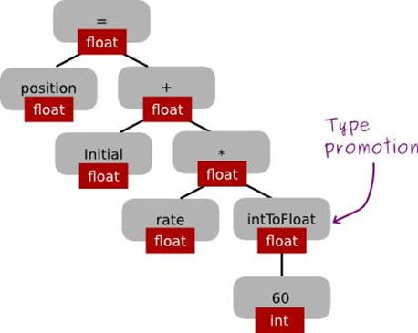
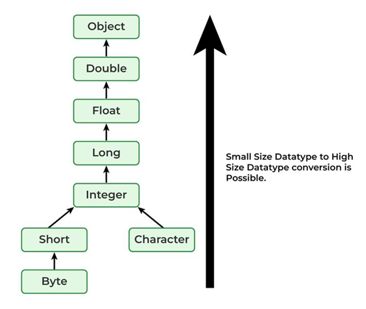

# Type Promotion in Java

## 🔹 What is Type Promotion in Java?

Type promotion means automatically converting smaller data types into a larger data type during expressions or operations.

👉 It happens when Java evaluates expressions, especially arithmetic ones.

---

## 🔹 Why Type Promotion Happens

Java promotes types to:

- avoid data loss
- maintain precision
- make operations consistent

<p align="center">
    
</p>

---

## 🔹 Basic Rule

👉 In expressions, smaller types are promoted to larger types.

---

## 🔹 Important Rule (Very Important ⭐)

Even if you use small types like `byte`, `short`, or `char`:

👉 Java converts them to `int` before performing operations.

---

## 🔸 Example 1 (Common Interview Question)

```java
byte a = 10;
byte b = 20;

// byte c = a + b; ❌ ERROR

int c = a + b;   // ✅ Correct
```

👉 Why?

- `a + b` becomes `int` automatically.
- So the result must be stored in `int`.

---

## 🔹 Promotion Order

<p align="center">
    
</p>

```text
byte → short → int → long → float → double
```

---

## 🔸 Example 2 (Mixed Types)

```java
int a = 10;
double b = 5.5;

double result = a + b;   // int → double
```

👉 Result is `double` because:

- Java promotes `int → double`.

---
## 🔹 Example 3 (Complex Expression)

```java
int a = 5;
long b = 10;
float c = 2.5f;

float result = a + b + c;
```

👉 Steps:

- `a → long`
- then → `float`
- final result = `float`

---

## 🔹 Key Rules of Type Promotion

1. `byte`, `short`, `char` → promoted to `int`
2. If one operand is larger → smaller converts to larger
3. Result type = largest data type in expression

---

## 🔹 Type Promotion vs Type Casting

| Feature | Type Promotion | Type Casting |
|----------|----------------|--------------|
| Happens when | Expression evaluation | Manual conversion |
| Done by | Java automatically | Programmer |
| Purpose | Perform operations | Force conversion |

---

## 🔹 Quick Summary

```text
Expression
      ↓
Automatic Conversion
      ↓
Result Type = Largest Data Type
```

---

## 🔹 Example Programs

Two example programs are provided in this folder.

### 📄 TypePromotionDemo.java

Demonstrates:

- Type promotion in arithmetic expressions
- Mixed data type operations
- Promotion to the largest data type

---

### 📄 BytePromotionDemo.java

Demonstrates:

- Why `byte + byte` becomes `int`
- Promotion of `byte`, `short`, and `char` to `int`
- Common interview examples

---

## 🔹 How to Execute

Compile the programs:

```bash
javac TypePromotionDemo.java
javac BytePromotionDemo.java
```

Run the programs:

```bash
java TypePromotionDemo
```

```bash
java BytePromotionDemo
```

Observe how Java automatically promotes data types during expression evaluation.

---

## 🔹 One-Line Exam Definition

👉 **Type promotion in Java is the automatic conversion of smaller data types into a larger data type during expression evaluation to ensure accurate computation.**