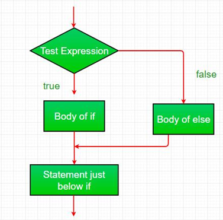
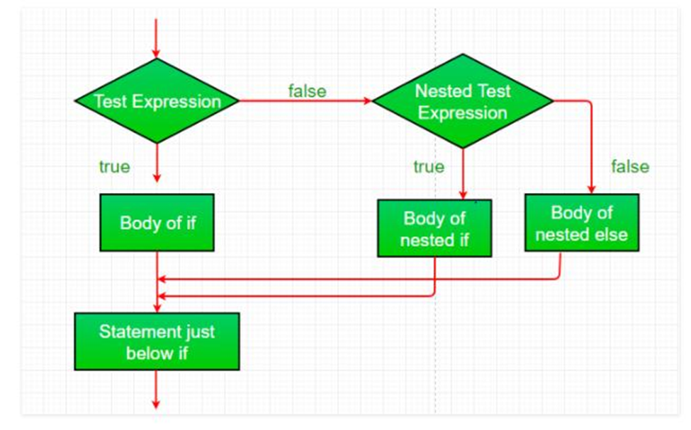
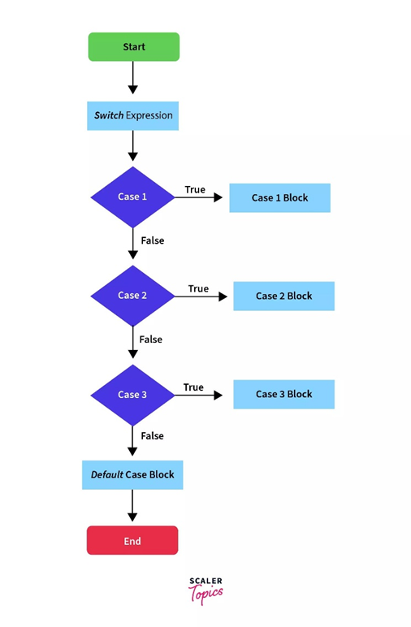

# Conditional Statements in Java

## 🔹 What are Conditional Statements in Java?

Conditional statements are used to make decisions in a program based on conditions.

👉 They control the flow of execution:

- If condition is true → one block runs
- If false → another block runs

---

## 🔹 Types of Conditional Statements

```text
Conditional Statements
 ├── if
 ├── if-else
 ├── else-if ladder
 ├── nested if
 └── switch
```

---

## 🔸 1. if Statement

Executes code only if the condition is `true`.

### Example

```java
int age = 18;

if (age >= 18) {
    System.out.println("Eligible to vote");
}
```

---

## 🔸 2. if-else Statement

Executes one block if the condition is `true`, otherwise executes another block.

### Example

```java
int age = 16;

if (age >= 18) {
    System.out.println("Adult");
} else {
    System.out.println("Minor");
}
```

<p align="center">
    
</p>

---

## 🔸 3. else-if Ladder

Used when there are multiple conditions.

### Example

```java
int marks = 75;

if (marks >= 90) {
    System.out.println("Grade A");
} else if (marks >= 60) {
    System.out.println("Grade B");
} else {
    System.out.println("Grade C");
}
```

---

## 🔸 4. Nested if

An `if` statement inside another `if` statement.

### Example

```java
int age = 20;
boolean hasID = true;

if (age >= 18) {
    if (hasID) {
        System.out.println("Allowed entry");
    }
}
```

<p align="center">
    
</p>

---
## 🔸 5. switch Statement

Used when you have multiple fixed choices.

### Example

```java
int day = 2;

switch (day) {
    case 1:
        System.out.println("Monday");
        break;

    case 2:
        System.out.println("Tuesday");
        break;

    default:
        System.out.println("Invalid");
}
```

<p align="center">
    
</p>

---

## 🔹 Key Points

- Conditions must return a boolean value (`true` or `false`).
- `else` is optional.
- `switch` is cleaner when working with multiple fixed values.
- Use `break` in a `switch` statement to avoid fall-through.

---

## 🔹 Quick Comparison

| Statement | Use Case |
|-----------|----------|
| if | Single condition |
| if-else | Two choices |
| else-if | Multiple conditions |
| switch | Fixed values (menu-like) |

---

## 🔹 Example Programs

The following example programs are available in this folder.

### 📄 IfStatementDemo.java

Demonstrates:

- Simple `if` statement
- Single condition

---

### 📄 IfElseDemo.java

Demonstrates:

- `if-else`
- Two possible outcomes

---

### 📄 ElseIfLadderDemo.java

Demonstrates:

- Multiple conditions
- Grade calculation example

---

### 📄 NestedIfDemo.java

Demonstrates:

- Nested `if`
- Multiple dependent conditions

---

### 📄 SwitchStatementDemo.java

Demonstrates:

- `switch` statement
- `case`
- `break`
- `default`

---

## 🔹 How to Execute

Compile all programs:

```bash
javac *.java
```

Or compile individually:

```bash
javac IfStatementDemo.java
javac IfElseDemo.java
javac ElseIfLadderDemo.java
javac NestedIfDemo.java
javac SwitchStatementDemo.java
```

Run any program:

```bash
java IfStatementDemo
java IfElseDemo
java ElseIfLadderDemo
java NestedIfDemo
java SwitchStatementDemo
```

---

## 🔹 One-Line Exam Definition

👉 **Conditional statements in Java are used to control the flow of execution based on conditions, allowing different actions depending on whether a condition is true or false.**