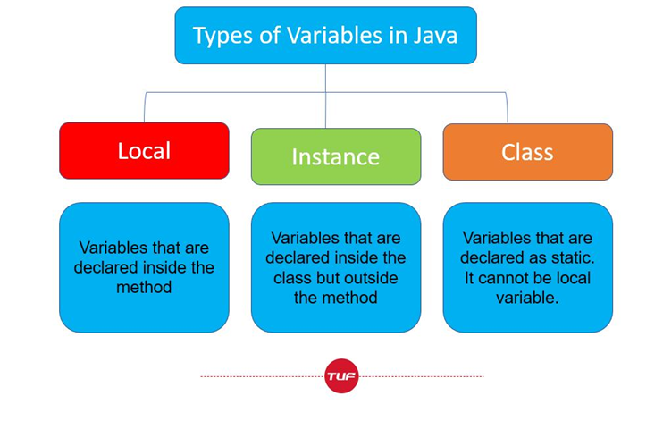
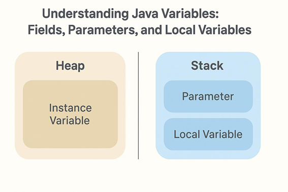
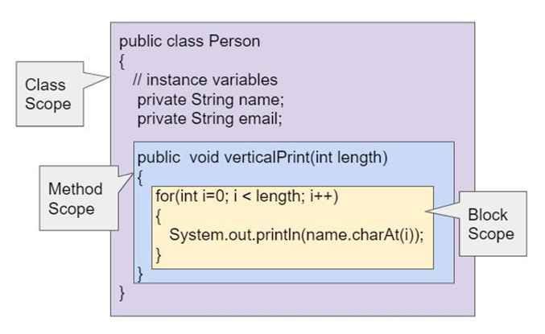

# Variables in Java

Variables are named memory locations used to store data during program execution. They allow programs to store, update, and manipulate data. In Java, variables are classified based on where they are declared and how long they exist.

---

## Quick Summary

- Variables store data in memory.
- Java provides three types of variables: Local, Instance, and Class (Static).
- Each variable type has a different scope, lifetime, and memory allocation.
- Local variables must be initialized before use.
- Instance and class variables receive default values.

---

## One-Line Definition

A variable is a named memory location used to store data that can change during program execution.

---

## Types of Variables

<p align="center">
    
</p>

Java provides three types of variables:

- **Local Variables**
- **Instance Variables**
- **Class (Static) Variables**

### 1. Local Variables

A local variable is declared inside a method, constructor, or block.

**Characteristics**

- Accessible only within the block where it is declared.
- Created when the method is invoked.
- Destroyed after the method finishes execution.
- Must be initialized before use.
- Stored in Stack memory.

```java
class Student {
    void display() {
        int marks = 90;
        System.out.println(marks);
    }
}
```

---

### 2. Instance Variables

An instance variable is declared inside a class but outside methods, constructors, or blocks.

**Characteristics**

- Belongs to an object.
- Each object has its own copy.
- Receives default values automatically.
- Stored in Heap memory.

```java
class Student {
    int id;
    String name;
}
```

---

### 3. Class (Static) Variables

A class variable is declared using the `static` keyword.

**Characteristics**

- Belongs to the class instead of objects.
- Shared among all objects.
- Created only once when the class is loaded.

> **Note:** The `static` keyword will be covered in the **Static Keyword** topic.

---

## Memory Allocation

<p align="center">
    
</p>

Different types of variables are stored in different memory areas.

| Variable Type | Memory Location |
|---------------|-----------------|
| Local Variable | Stack |
| Parameter Variable | Stack |
| Instance Variable | Heap |
| Class Variable | Method Area (Metaspace) |

---

## Reference Variables

A reference variable stores the memory address (reference) of an object instead of the actual object.

### Key Idea

- Objects are stored in **Heap memory**.
- Reference variables are stored in **Stack memory**.
- A reference variable points to an object in Heap memory.

### Example

```java
class Student {
    int id;
}

public class Main {
    public static void main(String[] args) {
        Student s1 = new Student();
    }
}
```

Here:

- `new Student()` creates a `Student` object in Heap memory.
- `s1` is a reference variable that points to the object.

### Multiple Reference Variables

Multiple reference variables can point to the same object.

```java
class Student {
    int id;
}

public class Main {
    public static void main(String[] args) {
        Student s1 = new Student();
        Student s2 = s1;

        s1.id = 101;

        System.out.println(s2.id);
    }
}
```

**Output**

```text
101
```

Since both `s1` and `s2` point to the same object, changes made using one reference are reflected through the other.

### Null Reference

A reference variable can point to nothing using the `null` keyword.

```java
Student s = null;
```

Here, `s` does not point to any object.

### Reference Variable vs Primitive Variable

| Feature | Reference Variable | Primitive Variable |
|---------|--------------------|--------------------|
| Stores | Memory address | Actual value |
| Memory | Stack (reference) + Heap (object) | Stack |
| Example | `Student s` | `int x = 10` |

---

## Variable Scope

<p align="center">
    
</p>

The scope of a variable determines where it can be accessed.

- **Class Scope** – Instance and class variables are accessible throughout the class.
- **Method Scope** – Parameters and local variables are accessible only inside the method.
- **Block Scope** – Variables declared inside loops or conditional blocks are accessible only within that block.

---

## Default Values

Only **instance variables** and **class variables** receive default values automatically.

| Data Type | Default Value |
|-----------|--------------|
| byte | 0 |
| short | 0 |
| int | 0 |
| long | 0L |
| float | 0.0f |
| double | 0.0 |
| char | '\u0000' |
| boolean | false |
| Object Reference | null |

> **Note:** Local variables do not receive default values and must be initialized before use.

---

## Comparison of Variable Types

| Feature | Local Variable | Instance Variable | Class Variable |
|---------|---------------|-------------------|----------------|
| Declared Inside | Method, Constructor, or Block | Class | Class (`static`) |
| Belongs To | Method | Object | Class |
| Scope | Method/Block | Entire Object | Entire Class |
| Memory | Stack | Heap | Method Area (Metaspace) |
| Default Value | No | Yes | Yes |
| Shared Among Objects | No | No | Yes |

---

## Summary

- Variables store data during program execution.
- Java provides Local, Instance, and Class (Static) variables.
- Local variables exist only within methods or blocks.
- Instance variables belong to objects.
- Class variables are shared among all objects.
- Local variables are stored in Stack memory.
- Instance variables are stored in Heap memory.
- Class variables are stored in the Method Area (Metaspace).
- Reference variables store the memory address of objects created in Heap memory.
- Local variables must be initialized before use.