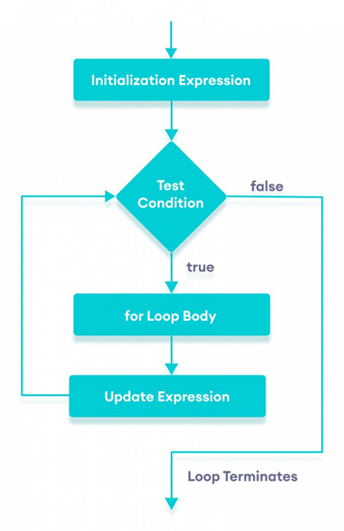
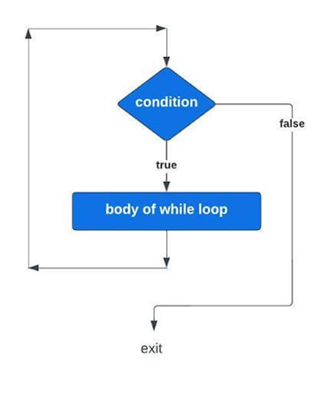
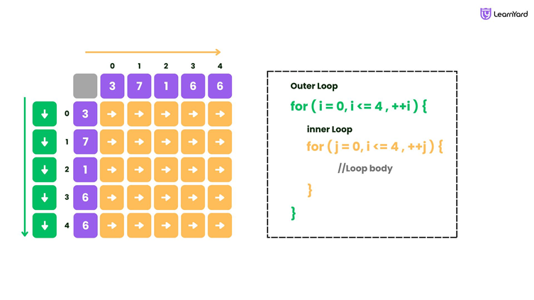

# Loops in Java

## 🔹 What are Loops in Java?

Loops are used to execute a block of code repeatedly until a condition becomes false.

👉 Instead of writing the same code multiple times, loops automate repetition.

---

## 🔹 Types of Loops in Java

```text
Loops
 ├── for loop
 ├── while loop
 ├── do-while loop
 └── for-each loop (Enhanced for)
```

---

## 🔸 1. for Loop

Used when you know the number of iterations.

### ✔ Syntax

```java
for (initialization; condition; update) {
    // code
}
```

### ✔ Example

```java
for (int i = 1; i <= 5; i++) {
    System.out.println(i);
}
```

**Output**

```text
1
2
3
4
5
```

<p align="center">
    
</p>

---

## 🔸 2. while Loop

Used when the condition is checked before execution.

### ✔ Syntax

```java
while (condition) {
    // code
}
```

### ✔ Example

```java
int i = 1;

while (i <= 5) {
    System.out.println(i);
    i++;
}
```

**Output**

```text
1
2
3
4
5
```

<p align="center">
    
</p>

---

## 🔸 3. do-while Loop

Executes at least once, even if the condition is false.

### ✔ Syntax

```java
do {
    // code
} while (condition);
```

### ✔ Example

```java
int i = 1;

do {
    System.out.println(i);
    i++;
} while (i <= 5);
```

**Output**

```text
1
2
3
4
5
```

---

## 🔸 4. for-each Loop (Enhanced for)

Used for arrays or collections.

### ✔ Example

```java
int[] arr = {10, 20, 30};

for (int num : arr) {
    System.out.println(num);
}
```

**Output**

```text
10
20
30
```

---
## 🔹 Key Differences

| Loop | Condition Check | Use Case |
|------|-----------------|----------|
| **for** | Before | Known iterations |
| **while** | Before | Unknown iterations |
| **do-while** | After | Must run at least once |
| **for-each** | Internal | Arrays / Collections |

---

## 🔹 Loop Control Statements

Java provides two loop control statements:

- `break` → exits the loop immediately.
- `continue` → skips the current iteration and continues with the next iteration.

### ✔ Example

```java
for (int i = 1; i <= 5; i++) {
    if (i == 3)
        continue;
    System.out.println(i);
}
```

**Output**

```text
1
2
4
5
```

---

# 🔹 Nested Loops in Java

A **nested loop** is a loop inside another loop.

👉 The inner loop runs completely for every iteration of the outer loop.

---

## ✔ Basic Structure

```java
for (initialization1; condition1; update1) {
    for (initialization2; condition2; update2) {
        // inner loop code
    }
}
```

---

## 🔹 How It Works

If the outer loop runs **3 times** and the inner loop runs **2 times**:

```text
Total Executions = 3 × 2 = 6
```

---

## ✔ Example

```java
for (int i = 1; i <= 3; i++) {
    for (int j = 1; j <= 2; j++) {
        System.out.println("i=" + i + ", j=" + j);
    }
}
```

**Output**

```text
i=1, j=1
i=1, j=2
i=2, j=1
i=2, j=2
i=3, j=1
i=3, j=2
```

<p align="center">
    
</p>

---

## 🔹 Key Points

- The inner loop completes fully for every iteration of the outer loop.
- Commonly used for:
  - Pattern printing
  - 2D Arrays (Matrices)
  - Multiplication tables

---

## 🔹 Real-Life Analogy

Think of it like:

- **Outer Loop → Days**
- **Inner Loop → Hours**

For every day, all the hours are completed.

---

## 🔹 Quick Summary

- **for** → Fixed number of iterations
- **while** → Condition-based iterations
- **do-while** → Executes at least once
- **for-each** → Used for arrays and collections
- **Nested loop** → Loop inside another loop

---

## 🔹 Example Programs

The following Java programs are available in this folder:

- 📄 `ForLoopDemo.java`
- 📄 `WhileLoopDemo.java`
- 📄 `DoWhileLoopDemo.java`
- 📄 `ForEachLoopDemo.java`
- 📄 `BreakContinueDemo.java`
- 📄 `NestedLoopDemo.java`

These programs provide practical examples for all the concepts explained in this README.

---

## 🔹 How to Execute

### Compile all Java programs

```bash
javac *.java
```

### Or compile individual programs

```bash
javac ForLoopDemo.java
javac WhileLoopDemo.java
javac DoWhileLoopDemo.java
javac ForEachLoopDemo.java
javac BreakContinueDemo.java
javac NestedLoopDemo.java
```

### Run the desired program

```bash
java ForLoopDemo
java WhileLoopDemo
java DoWhileLoopDemo
java ForEachLoopDemo
java BreakContinueDemo
java NestedLoopDemo
```

---

## 🔹 One-Line Exam Definition

👉 **Loops in Java are control structures used to execute a block of code repeatedly based on a condition.**