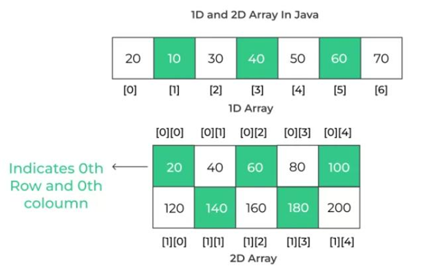
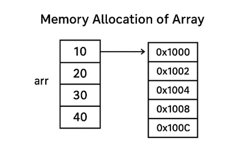
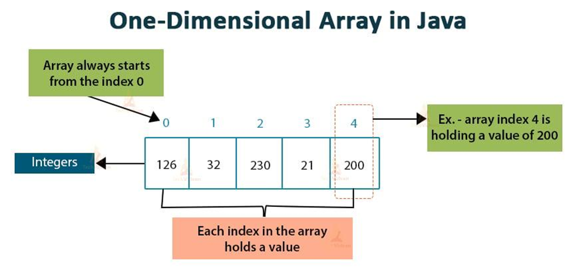

# Introduction to Arrays

## One-Line Definition

**An array in Java is a collection of elements of the same data type stored in contiguous memory locations and accessed using an index.**

---

## What is an Array in Java?

An array is a collection of elements of the same data type stored in contiguous memory locations.

**In simple terms:**

> **Array = A group of variables of the same data type stored under one name.**

---

## Why Use Arrays?

- Store multiple values in a single variable.
- Easy to manage large amounts of data.
- Access elements quickly using an index.
- Reduces the need to create multiple variables of the same type.

---

## Declaration of Array

An array is declared by specifying the data type followed by square brackets (`[]`) and the array name.

### Syntax

```java
datatype[] arrayName;
```

### Example

```java
int[] arr;
```

---

## Array Creation

After declaration, memory is allocated to the array using the `new` keyword.

### Syntax

```java
arrayName = new datatype[size];
```

### Example

```java
arr = new int[5];
```

The above statement creates an integer array that can store **5** elements.

---

## Declaration, Creation, and Initialization

Declaration, creation, and initialization can all be done in a single statement.

### Example

```java
int[] arr = {10, 20, 30, 40, 50};
```

---

## Accessing Elements

Array elements are accessed using their **index**. The index always starts from **0**.

### Example

```java
System.out.println(arr[0]); // 10
System.out.println(arr[2]); // 30
```

<p align="center">
    
</p>

---

## Example Program

The complete example program is available in **`ArrayIntroduction.java`**.

This program demonstrates:

- Array declaration
- Array creation and initialization
- Accessing array elements
- Traversing an array using a `for` loop

### How to Run the Program

1. Open a terminal or command prompt.
2. Navigate to the directory containing the file.
3. Compile the program:

```bash
javac ArrayIntroduction.java
```

4. Run the program:

```bash
java ArrayIntroduction
```

---

## Memory Representation

Array elements are stored in **contiguous memory locations**, allowing fast and efficient access using their index.

<p align="center">
    
</p>

---

## Types of Arrays in Java

Java mainly supports the following types of arrays.

### 1. One-Dimensional Array

A one-dimensional array stores elements in a single sequence.

```java
int[] arr = {1, 2, 3};
```

### 2. Multi-Dimensional Array

A multi-dimensional array is an array of arrays.

```java
int[][] matrix = {
    {1, 2},
    {3, 4}
};
```

<p align="center">
    
</p>

---

## Important Properties

- Stores elements of the same data type.
- Uses **zero-based indexing**.
- Has a fixed size once created.
- Elements are stored in contiguous memory locations.
- Arrays are objects and are stored in **Heap Memory**.
- Can store both primitive data types and object references.

---

## Common Errors

### ArrayIndexOutOfBoundsException

Occurs when trying to access an index outside the valid range.

```java
arr[10];
```

---

## Summary

- An array stores multiple elements of the same data type under a single variable.
- Elements are stored in contiguous memory locations.
- Arrays use **zero-based indexing** to access elements.
- Arrays have a fixed size after creation.
- Arrays can store both primitive data types and object references.