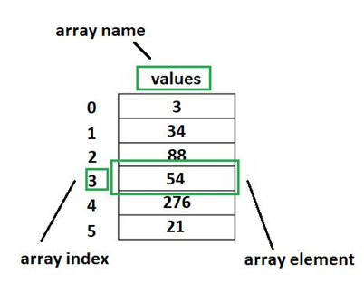

# Array Indexing in Java

## One-Line Definition

**Index values in Java arrays represent the position of elements, starting from `0` and ending at `length - 1`.**

---

## What are Index Values (Index Numbers) in Java Arrays?

Index values are the positions of elements in an array.

**In Java:**

- Index starts from **0**.
- Each element is accessed using its index.
- Every element has a unique index.

---

## Example

```java
int[] arr = {10, 20, 30, 40};
```

**Index Positions:**

| Index | Value |
|:-----:|:-----:|
| 0 | 10 |
| 1 | 20 |
| 2 | 30 |
| 3 | 40 |

---

## Visual Representation

<p align="center">
    
</p>

---

## Accessing Elements Using Index

Elements are accessed by specifying their index inside square brackets (`[]`).

### Example

```java
System.out.println(arr[0]); // 10
System.out.println(arr[2]); // 30
```

---

## Important Rules

- The **first index** is always **0**.
- The **last index** is always **array length - 1**.

### Example

```java
int[] arr = new int[5];
```

**Valid index range:**

```text
0 to 4
```

---

## Using the `length` Property

The `length` property returns the total number of elements in an array.

### Example

```java
System.out.println(arr.length); // 5
```

To access the last element:

```java
arr[arr.length - 1];
```

---

## Traversing an Array Using Index

Indexes are commonly used with loops to access every element in an array.

### Example

```java
for (int i = 0; i < arr.length; i++) {
    System.out.println(arr[i]);
}
```

---

## Example Program

The complete example program is available in **`ArrayIndexing.java`**.

This program demonstrates:

- Accessing elements using indexes.
- Finding the last element using `length - 1`.
- Traversing an array using a `for` loop.

### How to Run the Program

1. Save the file as **`ArrayIndexing.java`**.
2. Open a terminal or command prompt.
3. Navigate to the directory containing the file.
4. Compile the program:

```bash
javac ArrayIndexing.java
```

5. Run the compiled program:

```bash
java ArrayIndexing
```

---

## Summary

- An index represents the position of an element in an array.
- Array indexing always starts from **0**.
- The last valid index is **array length - 1**.
- Use the `length` property to determine the size of an array.
- Indexing enables quick and efficient access to array elements.