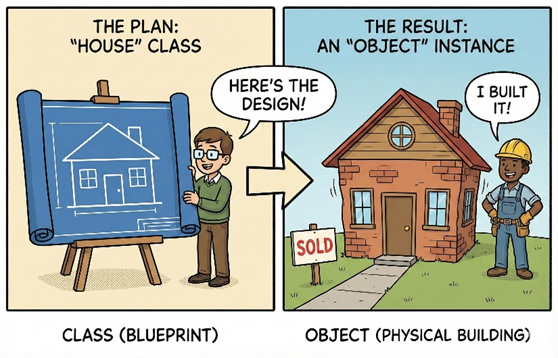
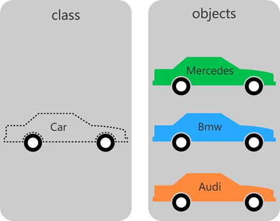
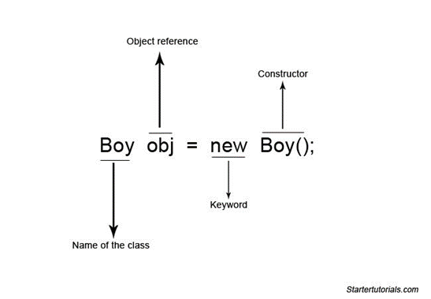

# Class and Object in Java

## 🔹 What is OOP in Java?

OOP (Object-Oriented Programming) is a programming approach where we design programs using **objects** and **classes** instead of just functions and logic.

👉 It helps in:

- Organizing code
- Reusing code
- Making programs easier to maintain

---

## 🔹 Main Concepts of OOP

```text
OOP Concepts
 ├── Class
 ├── Object
 ├── Inheritance
 ├── Polymorphism
 ├── Encapsulation
 └── Abstraction
```

> 💡 **Note:** In this topic, we will focus only on **Class** and **Object**, which are the foundation of Object-Oriented Programming.

---

## 🔸 What is a Class?

A **class** is a blueprint or template used to create objects.

It defines:

- Variables (Data / Properties)
- Methods (Functions / Behavior)

<p align="center">
    
</p>

### ✔ Example of a Class

```java
class Student {
    int id;
    String name;
    void display() {
        System.out.println(id + " " + name);
    }
}
```

👉 Here:

- `Student` → Class
- `id`, `name` → Variables
- `display()` → Method

---

## 🔸 What is an Object?

An **object** is a real-world instance of a class.

It:

- Stores actual values.
- Can access variables and methods of the class.

<p align="center">
    
</p>

### ✔ Example of an Object

```java
public class Main {
    public static void main(String[] args) {
        Student s1 = new Student();
        s1.id = 1;
        s1.name = "John";
        s1.display();
    }
}
```

<p align="center">
    
</p>

---

## 🔹 Key Differences

| Class | Object |
|--------|---------|
| Blueprint | Instance |
| Logical entity | Real entity |
| No memory allocated | Memory allocated |
| Defines structure | Holds actual data |

---

## 🔹 Simple Analogy

👉 **Class** = Blueprint of a House

👉 **Object** = Actual House Built

---

## 🔹 Quick Summary

- Class → Template
- Object → Instance created from a class
- One class can create multiple objects
- Objects store actual data and can use class methods

---

## 🔹 Example Program

The following Java program is available in this folder:

- 📄 `ClassObjectDemo.java`

This program demonstrates:

- Creating a class
- Creating multiple objects
- Assigning values to object variables
- Calling object methods

---

## 🔹 How to Execute

Compile the program:

```bash
javac ClassObjectDemo.java
```

Run the program:

```bash
java ClassObjectDemo
```

---

## 🔹 One-Line Exam Definition

👉 **Object-Oriented Programming (OOP) is a programming paradigm based on objects and classes, where a class defines properties and behavior, and an object is an instance of that class.**