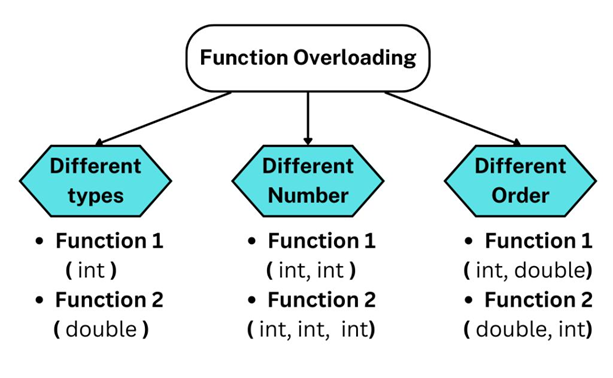
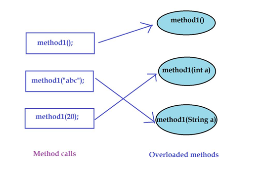

# Method Overloading in Java

## 🔹 What is Method Overloading?

Method overloading means defining multiple methods with the **same name** but **different parameters** in the **same class**.

👉 It is an example of **compile-time polymorphism**, where the method to be executed is decided by the compiler during compilation.

---

## 🔹 Why Use Method Overloading?

Method overloading helps to:

- Improve code readability
- Reuse the same method name for similar operations
- Reduce code duplication
- Make programs easier to understand and maintain

---

## 🔹 Rules for Method Overloading

A method is considered overloaded if it has:

- A different **number of parameters**, OR
- Different **data types** of parameters, OR
- A different **order** of parameters

<p align="center">
    
</p>

> ❌ **Changing only the return type does NOT create an overloaded method.**

---

## 🔸 Example 1 – Different Number of Parameters

```java
class MathUtil {
    int add(int a, int b) {
        return a + b;
    }

    int add(int a, int b, int c) {
        return a + b + c;
    }
}
```

---

## 🔸 Example 2 – Different Data Types

```java
class MathUtil {
    int add(int a, int b) {
        return a + b;
    }

    double add(double a, double b) {
        return a + b;
    }
}
```

---

## 🔸 Example 3 – Different Order of Parameters

```java
class Example {
    void show(int a, String b) {
        System.out.println(a + " " + b);
    }

    void show(String b, int a) {
        System.out.println(b + " " + a);
    }
}
```

---

## 🔹 How Java Decides Which Method to Call

Java selects the appropriate overloaded method based on:

- Number of arguments
- Type of arguments
- Order of arguments

<p align="center">
    
</p>

---

## 🔹 Important Note

The following is **NOT** method overloading:

```java
int add(int a, int b) {
    return a + b;
}

double add(int a, int b) {
    return a + b;
}
```

❌ This produces a compilation error because both methods have the **same parameter list**.

Changing only the return type is **not sufficient** for method overloading.

---

## 🔹 Quick Summary

- Same method name
- Different parameter list
- Same class
- Compile-time polymorphism
- Improves code readability and reusability

---

## 🔹 Example Program

The following Java program is available in this folder:

- 📄 `MethodOverloadingDemo.java`

This program demonstrates:

- Method overloading with different number of parameters
- Method overloading with different data types
- Method overloading with different parameter order
- Calling overloaded methods

---

## 🔹 How to Execute

Compile the program:

```bash
javac MethodOverloadingDemo.java
```

Run the program:

```bash
java MethodOverloadingDemo
```

---

## 🔹 One-Line Exam Definition

👉 **Method overloading in Java is the process of defining multiple methods with the same name but different parameter lists in the same class, allowing compile-time polymorphism.**